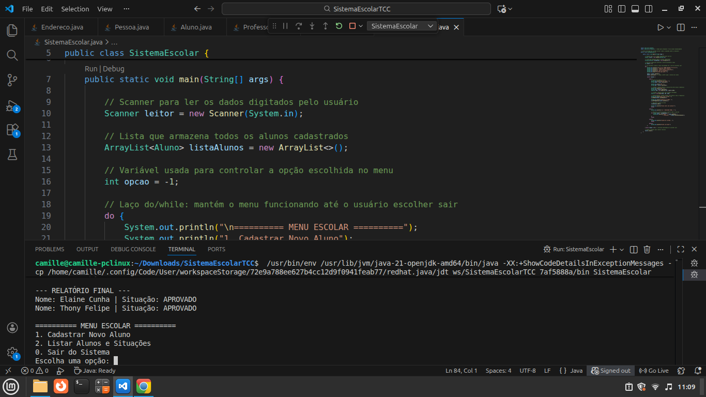

# Sistema de Gestão Escolar (Módulo I)
> **Projeto de TCC:** Desenvolvimento de um Sistema de Gerenciamento de Alunos e Disciplinas via Console.

## Descrição do Projeto
Este sistema foi desenvolvido como parte do Trabalho de Conclusão de Curso, com o objetivo de integrar os conceitos fundamentais da programação orientada a objetos (POO) em Java. O software permite o cadastro de alunos, professores e disciplinas, realizando o cálculo automático da situação acadêmica com base em notas e frequência.

## Tecnologias Utilizadas
* **Linguagem:** Java 17+
* **IDE:** Visual Studio Code (VS Code)
* **Paradigma:** Orientação a Objetos

## Arquitetura e Conceitos Aplicados
O sistema foi estruturado seguindo os pilares da POO para garantir organização e modularidade:

* **Abstração e Herança:** Uso da classe abstrata `Pessoa` como base para `Aluno` e `Professor`.
* **Encapsulamento:** Atributos privados com acesso via métodos *Getters* e *Setters*.
* **Associação:** Integração entre as classes `Endereco`, `Disciplina` e `Pessoa`.
* **Lógica de Negócio:** Algoritmos para cálculo de aprovação (Nota $\ge$ 7.0 e Frequência $\ge$ 75%).
* **Interatividade:** Interface via console utilizando `Scanner`, `switch/case` e laços `do/while`.

## Demonstração
Abaixo, uma captura de tela do sistema em execução no terminal do VS Code:

*(Substitua o caminho acima pelo nome do arquivo da sua imagem)*

## Estrutura de Arquivos
* `Pessoa.java`: Classe base (Abstrata).
* `Aluno.java`: Subclasse com lógica de aprovação.
* `Professor.java`: Subclasse para gestão de docentes.
* `Endereco.java`: Classe de apoio para associação de dados.
* `Disciplina.java`: Classe para gestão de matérias.
* `SistemaEscolar.java`: Classe principal com o menu de execução.

## Como Executar
1. Certifique-se de ter o **JDK** instalado em sua máquina.
2. Abra a pasta do projeto no **VS Code**.
3. Localize o arquivo `SistemaEscolar.java`.
4. Clique no botão **Run** ou pressione `F5`.

---
Desenvolvido por Elaine Cunha - 2026
